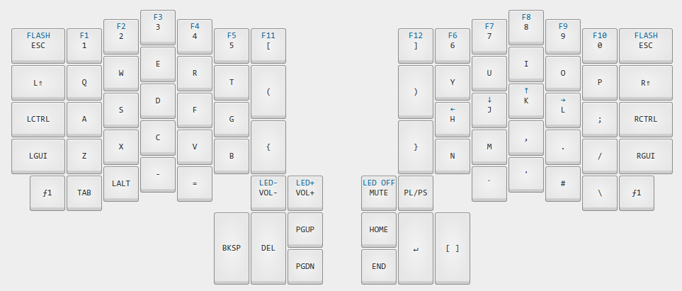

[kll][] files for my ergodox.

 * `make bootstrap` to fetch the dependencies.
 * `make compile` to build everything.
 * `make flash-left` flashes the left hand.
 * `make flash-right` flashes the right hand.

[kll]: https://github.com/kiibohd/kll
